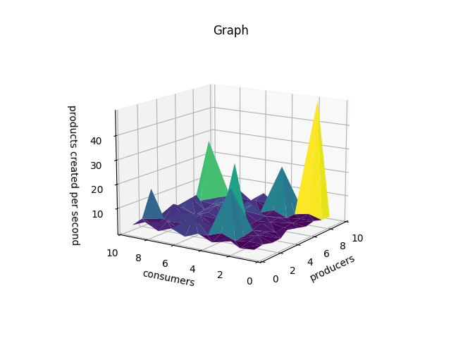
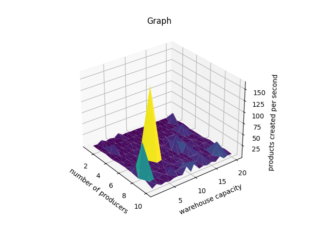
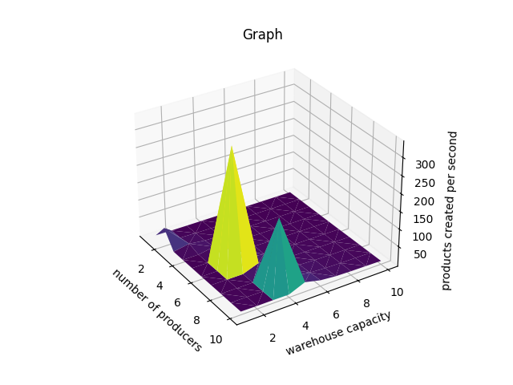
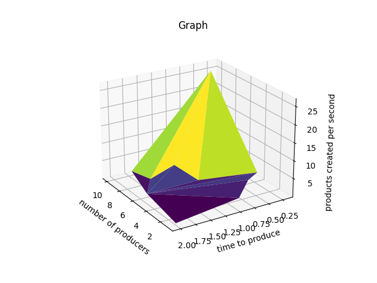
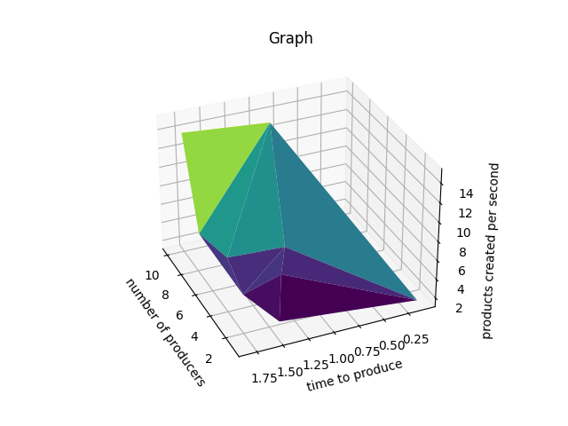

# 3. Assignment - lightswitch, consumer, producer


_Whole assignment in slovak ([link](https://uim.fei.stuba.sk/i-ppds/3-cvicenie-fibonacci-vypinac-p-k-c-z-%f0%9f%92%a1/?%2F))_

The main goal of this assignment is to implement and document the producer and consumer concept.

---
### Task
In the case of P-C, choose one of the criteria for the optimal task (number of products produced per unit of time or number of processed products per unit of time). 
Develop and thoroughly document an experiment optimization parameter for your system.

Implement the Consumer-Producer solution. Experiment with different system settings:

1. product production time,
2. product processing time,
3. number of consumers,
4. number of producers,
5. storage size.

Try to find out experimentally which parameters are optimal for your system. The optimality criteria should be:

1. Number of products produced per unit of time (in what relation are the production time of the product, the size of the repository, the number of producers and the number of consumers?),
2. Number of processed products per unit of time (in what relation are the processing time of the product, the size of the repository, the number of producers and the number of consumers?).

For experiments, average 10 experiment replicates at the same system settings; plot graphs for at least 100 different settings of the modeled system.

#### Solution:

To find optimal solution for this P-C problem is to create a grid search with plethora of parameters to find those that
fits best. As mentioned there are 5 parameters and that means that we have many options. For better overview we used 
combination of two of the parameters. Main metric for correct solution is Number of products produced per unit of time
concretely seconds, we will be using the acronym _pps_ (products per second). Let's dive in the code before we start
analyzing the results. Firstly let's look at producer function:
```python
def producer(shared, time_2create):
    while True: # always produce
        sleep(time_2create) # we wanna simulate creation of item
        shared.created += 1 # item created!
        shared.free.wait() # is there free space in warehouse ? if not wait
        if shared.finished: # end the loop
            break
        shared.mutex.lock()
        sleep(randint(1, 10) / 100) # store the item
        shared.mutex.unlock() 
        shared.items.signal() # thread is done
```
As we can see the producer simulates the production of item and then stores it in the warehouse. We want to
ensure that only one thread has access to a warehouse. We think the explanation why is that is trivial. The 
consumer function is the same but in reverse order:
```python
def consumer(shared, time_2process):
    while True:
        shared.items.wait() # is there item ? if yes take it
        if shared.finished: # end the loop
            break
        shared.mutex.lock()
        sleep(randint(1, 10) / 100) # find the item
        shared.mutex.unlock()
        shared.free.signal() # signal other threads that we are done
        sleep(time_2process) # process the item
        shared.processed += 1 # item processed !
```
We think this doesn't need another commentary. Let's move on to the main function. In the main we can find implementation
of grid search. We use 2 for loops that represents two axis in the graph, the third ax is the pps (in this graph pps is products crated, sorry for error in advance).  



As we can see the highest production is when the producers are at maximum (10 producers) are on one third of the producers.
So our conclusion is that optimal ratio between producers to consumers is circa 3:1. We can think that more producers
create more product but if there is no consumer to process them, then the productions is halted because of full warehouse/buffer.
So the threads are waiting for buffer to empty.

However P:C ratio isn't the only think that can affect the pps, there are more parameters in play.
There is buffer size or warehouse capacity for example. 



If we look at this graph, we can se the global maximum is around 6 producers to 10 capacity. Is good to mention that we
used 10 consumers in this experiment. One would say that bigger the warehouse the faster the production. Our conclusion
is that only if the producers number is big enough to fill the capacity, or the consumer number is slightly higher than the
producers numbers. If consumers can process the items slightly faster than the producers can create them, then the high
capacity can provide the space needed for flawless code execution, with minimal waiting. To support our claim we are showing
another graph with the same parameters, but the customers are set to producers+1.



We can see the results are very similar.

Another graph we want to mention is producers to time to produce an item. This should be easy, less time to produce faster 
the stream of execution (yet again the consumer number is equal to producers).



Well yes but no... We are backing to the first graph where we discuss the ratio between the 
producers and consumers. Is great that we have fast time to produce item and big warehouse, but if the consumers number
is low, or the process of the item is slow (very slow), we eventually fill the buffer and stop the code execution. So yet 
again we need to find the sweet spot to ratio between producing and consuming. 

Let's look at graph with P:C ratio is 3:1



We can see our assumption was wrong :(

Se we are going back to a drawing board.

---
## Conclusion

We found that for optimization of our system we need another testings. The main role in flawless code execution, and
the max production we need to find the best ratio between all 5 parameters. We tried to create an assumption , but this
assumption were proved to be false. In our experiments we find many interesting connection between specific parameters.
Mainly the time to create an item to a number of producers. There is direct proportion between those parameters but not
the pps. This is due to number of consumers and time to process the item (which are also in direct proportion). We also came
to a conclusion that warehouse capacity don't play that big of a role.


