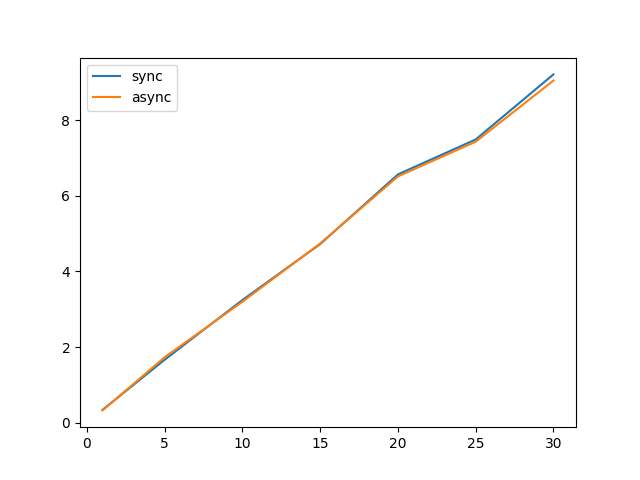

# 8. Assignment - Asynchronous programming in Python

_Whole assignment in slovak ([link](https://uim.fei.stuba.sk/i-ppds/8-cvicenie-asynchronne-programovanie/))_

---
### Task - Create a custom App asynchronously and synchronously
_Important Note: We call app server asynchronous, BUT! only functions that are making request for images are asynchronous._

Main goal of this task was to create two versions of one application.
One synchronous and one asynchronous. Then compare performance of this two 
applications. We created two simple python servers with request to random pics'
[generator]('https://picsum.photos/200/300'). We created loop in which we are making 
request for pictures, after we get the pictures we measure time on how long the all requests takes.
We used [asyncio](https://docs.python.org/3/library/asyncio.html) module to create native coroutines in an asynchronous 
version of our [app](appAsync.py). In particular `gather` attribute to make non-blocking calls for images.
In classical synchronous [app](appSync.py) we used a `for` loop to make https calls for images.


---



On this figure, where y-axis is representing time in seconds an x-axis is representing number of images(request) called,
we can see that only at 30 request made, there is noticeable difference (even that is quite small). Times elapsed are average calculated on 100 calls for `n` images. 
So for 15 images there are 1500 requests. Data might be distorting because internet bandwidth and/or speed takes huge role in corresponding times.

---
We took this even further and made calls to our servers in synchronous/asynchronous manner:
```
------ 15 request per call ------
50 async calls --> async server 233.3761327266693
50 async calls --> sync server 233.32999181747437
50 sync calls --> async server 235.26474571228027
50 sync calls --> sync server 239.74422645568848
```
As we can see, the asynchronous calls performed better than synchronous.

---
Sources
    
- Python server 
    - [link1](https://pythonbasics.org/webserver/)
    - [link2](https://docs.python.org/3/library/http.server.html)
- Python asyncio module [link](https://docs.python.org/3/library/asyncio.html)
- Python request object [link](https://www.w3schools.com/python/ref_requests_response.asp)  
_ Python GET and POST [link](https://www.geeksforgeeks.org/get-post-requests-using-python/)  
- **Pecinovský** Rudolf: (czech) Python, kompletní příručka jazyka pro verzi 3.10;
                              Grada Publishing; ISBN 978-80-271-3442-7 (print); Chapter: 39, Korutiny, vlákna, procesy; page 567.    
